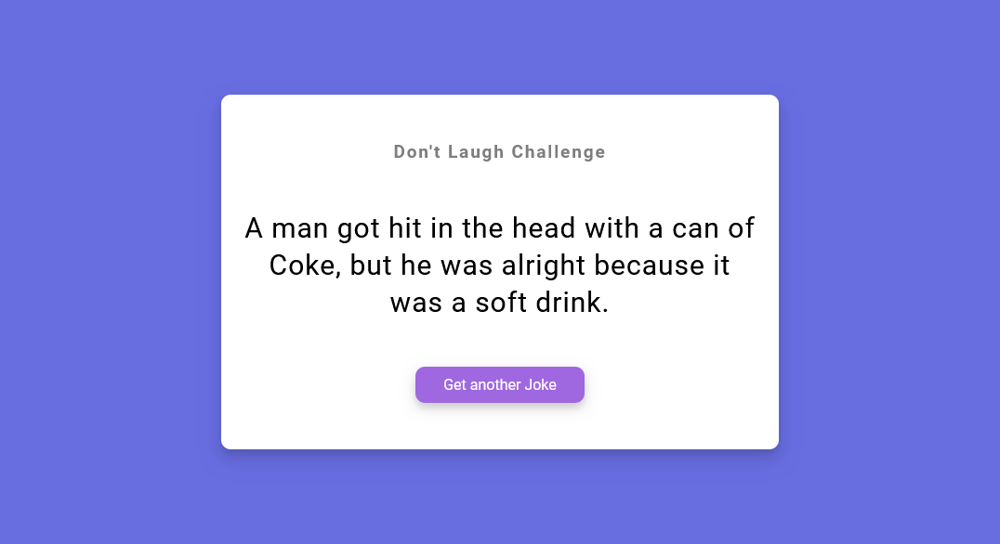

# 50 Projects in 50 days - Dad jokes solution

This is a solution to the [Dad jokes project of the course](https://www.udemy.com/course/50-projects-50-days/). 50 projects in 50 days helps to Sharpen your skills by building 50 quick, unique & fun mini projects.

## Table of contents

- [50 Projects in 50 days - Dad jokes solution](#50-projects-in-50-days---dad-jokes-solution)
  - [Table of contents](#table-of-contents)
  - [Overview](#overview)
    - [The challenge](#the-challenge)
    - [Screenshot](#screenshot)
    - [Links](#links)
  - [My process](#my-process)
    - [Built with](#built-with)
    - [What I learned](#what-i-learned)
    - [Useful resources](#useful-resources)
  - [Author](#author)

## Overview

### The challenge

Users should be able to:

- View the optimal layout depending on their device's screen size
- See hover states for interactive elements

### Screenshot

### Links

- Solution URL: [solution URL](https://github.com/SoloLere/50-projects-in-50-days.git)
- Live Site URL: [live site URL](#)

## My process

### Built with

- Semantic HTML5 markup
- CSS custom properties
- JavaScript

### What I learned

I used this project to go learn about asynchronous JS:
key takeaways:

- Calling the fetch function creates a promise object in the JS memory and calls the network request API.
- The content of the promise is a label (value) which will be assingned the return value of my network request.
- The promise object also contains an on-fulfillment array, which stores functions to be executed once the value property is updated.
- These functions will have value's property as their arguement
- The fuctions will be passed to the micro-task queue for execution
- All code in my script is run first before codes in the micro-task queue is run. A event loop checks to see if my Global execution context is empty, if it is, code in my micro-task queue is ran, and when the micro-task queue is empty, code in my callback queue is then executed.

### Useful resources

- [Resource 1](https://frontendmasters.com/courses/javascript-hard-parts-v2/) - This helped me understand Asynchronous JS and I really liked his pattern of explanation, it was quite engaging.

## Author

- Mail - [Oseni Solomon](jnrolalere@gmail.com)
