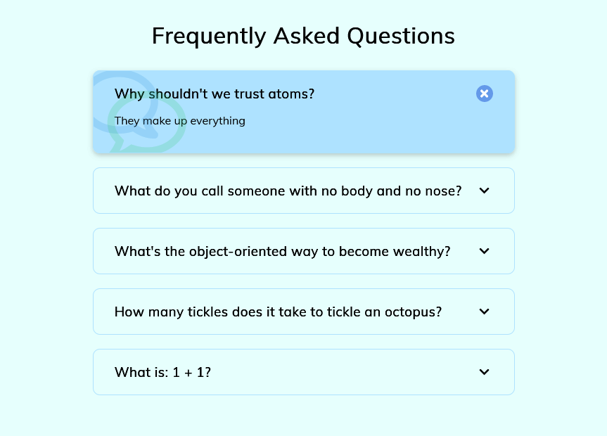

# 50 Projects in 50 days - FAQ Collapse solution

This is a solution to the [FAQ Collapse project of the course](https://www.udemy.com/course/50-projects-50-days/). 50 projects in 50 days helps to Sharpen your skills by building 50 quick, unique & fun mini projects.

## Table of contents

- [50 Projects in 50 days - FAQ Collapse solution](#50-projects-in-50-days---faq-collapse-solution)
  - [Table of contents](#table-of-contents)
  - [Overview](#overview)
    - [The challenge](#the-challenge)
    - [Screenshot](#screenshot)
    - [Links](#links)
  - [My process](#my-process)
    - [Built with](#built-with)
    - [What I learned](#what-i-learned)
  - [Author](#author)

## Overview

### The challenge

Users should be able to:

- View the optimal layout depending on their device's screen size
- See hover states for interactive elements

### Screenshot



### Links

- Solution URL: [solution URL](https://github.com/SoloLere/50-projects-in-50-days.git)
- Live Site URL: [live site URL](#)

## My process

### Built with

- Semantic HTML5 markup
- CSS custom properties
- Flexbox
- JavaScript

### What I learned

I can add Icons to my css file by using the Unicode of the desired icon.

```css
.faq.active::after {
  position: absolute;
  content: "\f075";
  font-family: "Font Awesome 5 free";
  font-size: 7rem;
  color: #2ecc71;
  z-index: 0;
  opacity: 0.2;
  top: 15px;
  left: 20px;
}
```

## Author

- Mail - [Oseni Solomon](jnrolalere@gmail.com)
