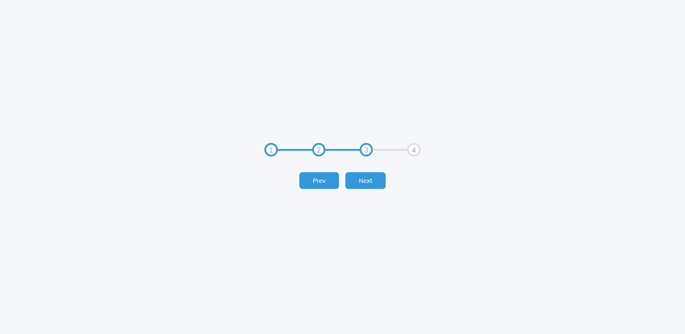

# 50 Projects in 50 days - Progress steps solution

This is a solution to the [Progress steps projects of the course](https://www.udemy.com/course/50-projects-50-days/). 50 projects in 50 days helps to Sharpen your skills by building 50 quick, unique & fun mini projects.

## Table of contents

- [50 Projects in 50 days - Progress steps solution](#50-projects-in-50-days---progress-steps-solution)
  - [Table of contents](#table-of-contents)
  - [Overview](#overview)
    - [The challenge](#the-challenge)
    - [Screenshot](#screenshot)
    - [Links](#links)
  - [My process](#my-process)
    - [Built with](#built-with)
    - [What I learned](#what-i-learned)
    - [Continued development](#continued-development)
  - [Author](#author)

## Overview

### The challenge

Users should be able to:

- View the optimal layout depending on their device's screen size
- See hover states for interactive elements

### Screenshot



### Links

- Solution URL: [solution URL](https://github.com/SoloLere/50-projects-in-50-days.git)
- Live Site URL: [live site URL](#)

## My process

### Built with

- Semantic HTML5 markup
- CSS custom properties
- Flexbox

### What I learned

- Learnt about the disabled attributes of buttons

```html
<button class="btn" id="prev" disabled>Prev</button>
```

- It can be styled using :disbaled psedo class selector in css

```css
.btn:disabled {
  background-color: var(--line-border-empty);
  cursor: not-allowed;
}
```

- Another cool way to style buttons when active is to scale them down.

```css
.btn:active {
  transform: scale(0.98);
}
```

### Continued development

Add a theme feature to the project.

## Author

- Mail - [Oseni Solomon](jnrolalere@gmail.com)
