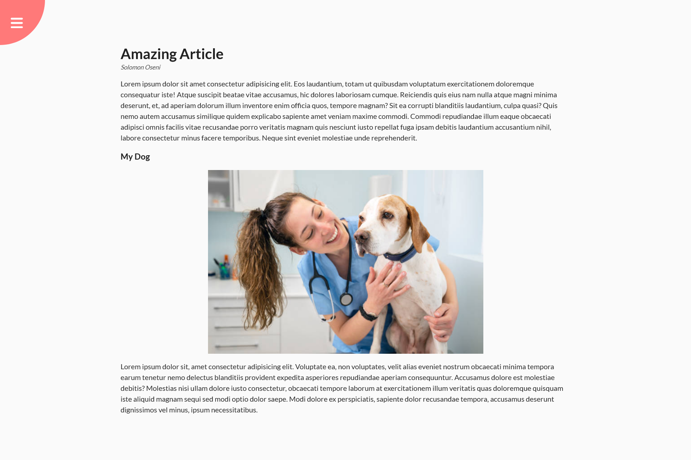
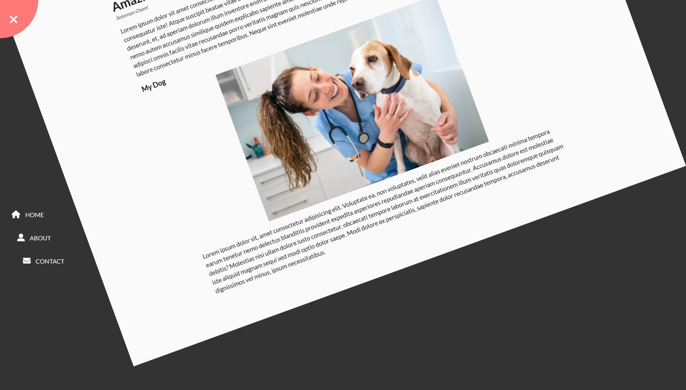

# 50 Projects in 50 days - Expanding Cards solution

This is a solution to the [Rotating Navigation project of the course](https://www.udemy.com/course/50-projects-50-days/). 50 projects in 50 days helps to Sharpen your skills by building 50 quick, unique & fun mini projects.

## Table of contents

- [50 Projects in 50 days - Expanding Cards solution](#50-projects-in-50-days---expanding-cards-solution)
  - [Table of contents](#table-of-contents)
  - [Overview](#overview)
    - [The challenge](#the-challenge)
    - [Screenshot](#screenshot)
    - [Links](#links)
  - [My process](#my-process)
    - [Built with](#built-with)
    - [What I learned](#what-i-learned)
  - [Author](#author)


## Overview

### The challenge

Users should be able to:

- Experience a rotating navigation feature whenever nav bar is toggled

### Screenshot




### Links

- Solution URL: [solution URL](https://github.com/SoloLere/50-projects-in-50-days.git)

## My process

### Built with

- Semantic HTML5 markup
- CSS 
- JavaScript


### What I learned

- Discovered the small element which can be used for small prints like legal texts, disclaimer, copyright. Small element renders it's content one font smaller than the parent.
  
```html
<small> Solomon</small>
```
- Introduced the animation feauture from Trillo project here. It changes the background of a content expanding upwards first, then sliding sideways.

```css
nav ul li a::before {
  z-index: -1;
  position: absolute;
  content: "";
  top: -10px;
  left: -5px;
  /* transform-origin: top; this would make the animation come down first before going wide; */
  width: 3px;
  height: 150%;
  background-color: #ff7979;
  transform: scaleY(0);
  transition: transform 0.2s, width 0.4s cubic-bezier(1, 0, 0, 1) 0.2s;
}

nav ul li a:hover::before {
  transform: scaleY(1);
  width: 130%;
}
```

## Author

- Mail - [Oseni Solomon](jnrolalere@gmail.com)

