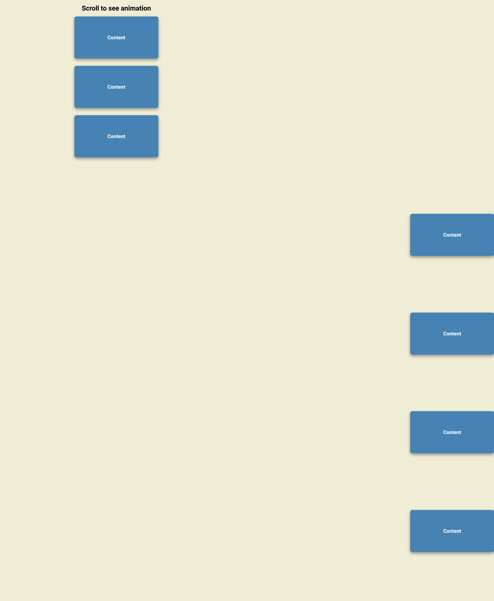

# 50 Projects in 50 days - Scroll Animation solution

This is a solution to the [Scroll Animation project of the course](https://www.udemy.com/course/50-projects-50-days/). 50 projects in 50 days helps to Sharpen your skills by building 50 quick, unique & fun mini projects.

## Table of contents

- [50 Projects in 50 days - Scroll Animation solution](#50-projects-in-50-days---scroll-animation-solution)
  - [Table of contents](#table-of-contents)
  - [Overview](#overview)
    - [The challenge](#the-challenge)
    - [Screenshot](#screenshot)
    - [Links](#links)
  - [My process](#my-process)
    - [Built with](#built-with)
    - [What I learned](#what-i-learned)
  - [Author](#author)


## Overview

### The challenge

Users should be able to:

- View the optimal layout depending on their device's screen Height

### Screenshot



### Links

- Solution URL: [solution URL](https://github.com/SoloLere/50-projects-in-50-days.git)

## My process

### Built with

- Semantic HTML5 markup
- CSS 
- JavaScript


### What I learned

- The getBoundingClientRect() method returned value is a DOMRect object which is the smallest rectangle which contains the entire element, including its padding and border-width. The left, top, right, bottom, x, y, width, and height properties describe the position and size of the overall rectangle in pixels.

```js
element.getBoundingClientRect();
```


## Author

- Mail - [Oseni Solomon](jnrolalere@gmail.com)


